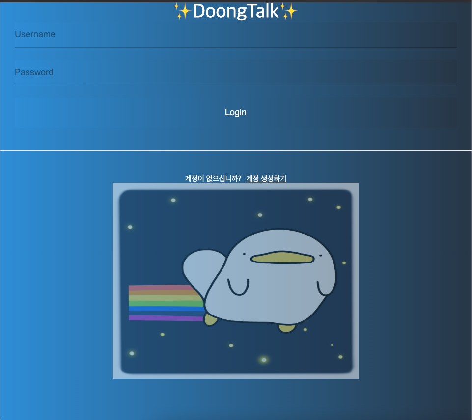
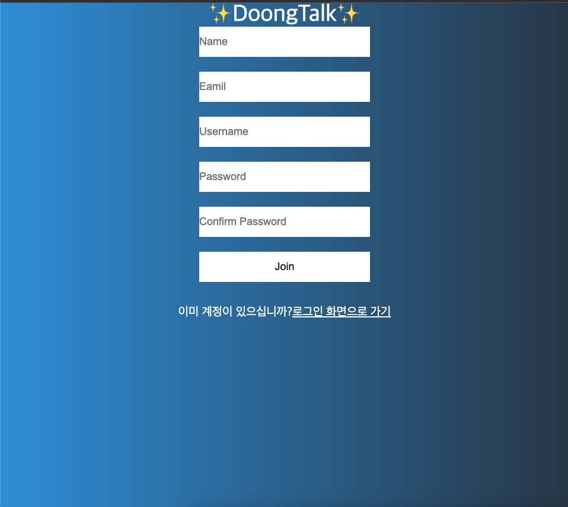
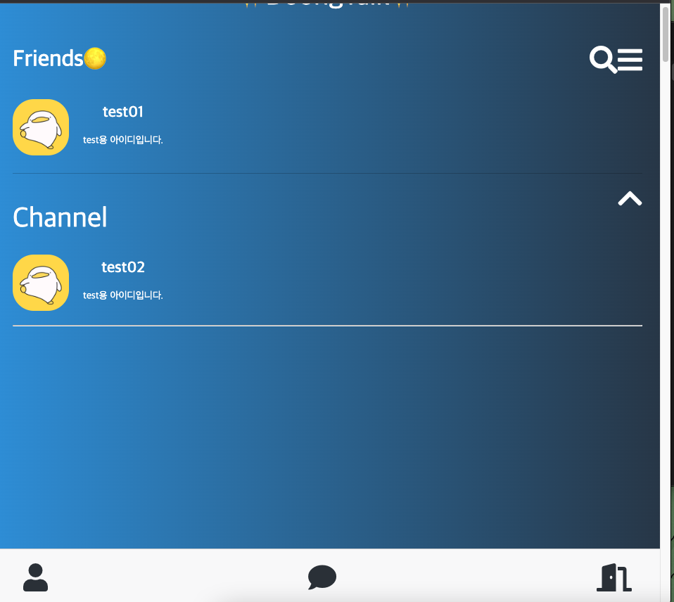
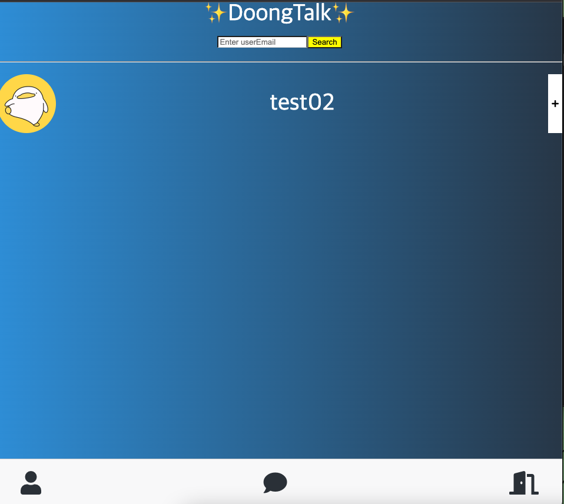
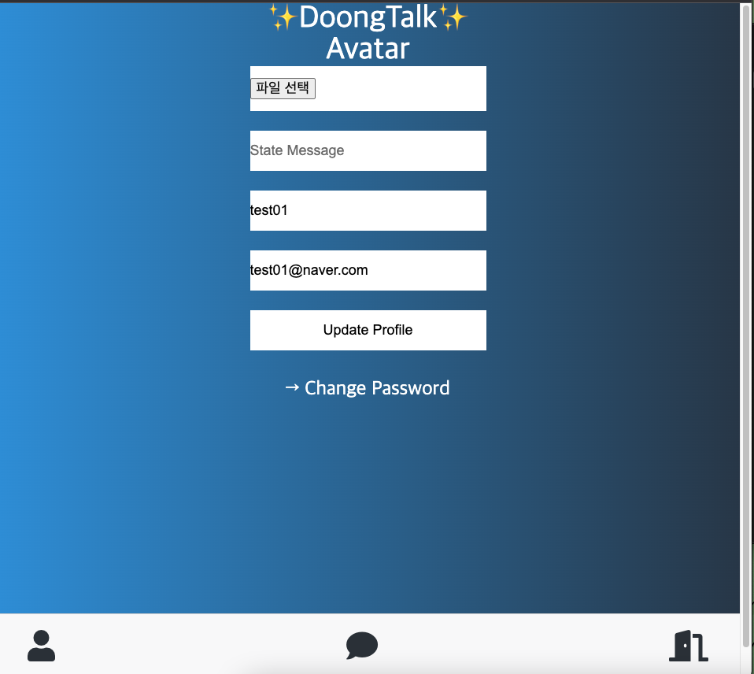
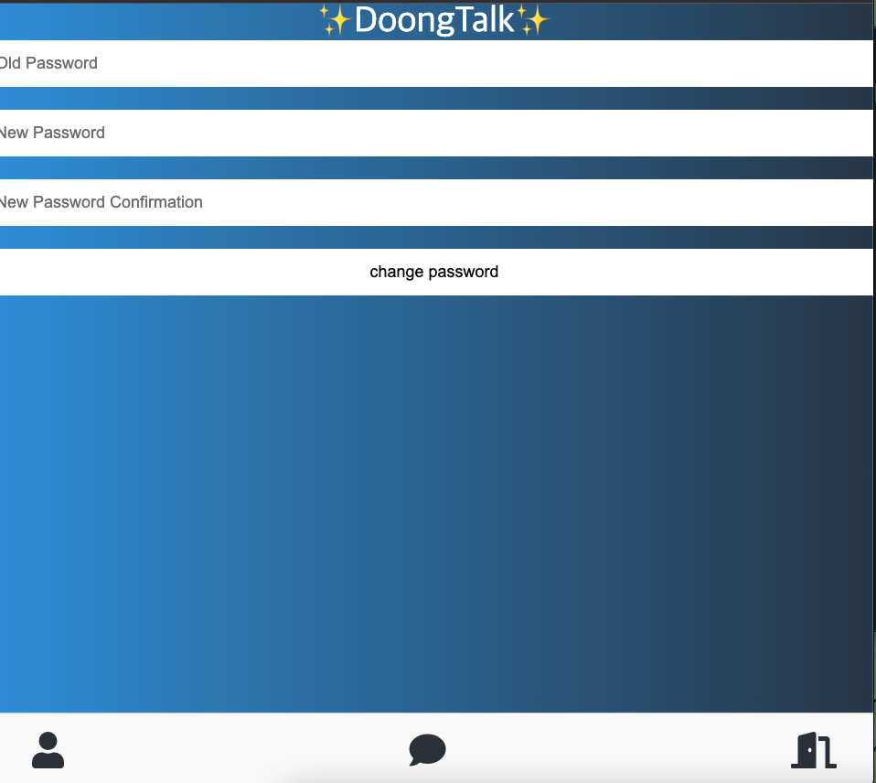
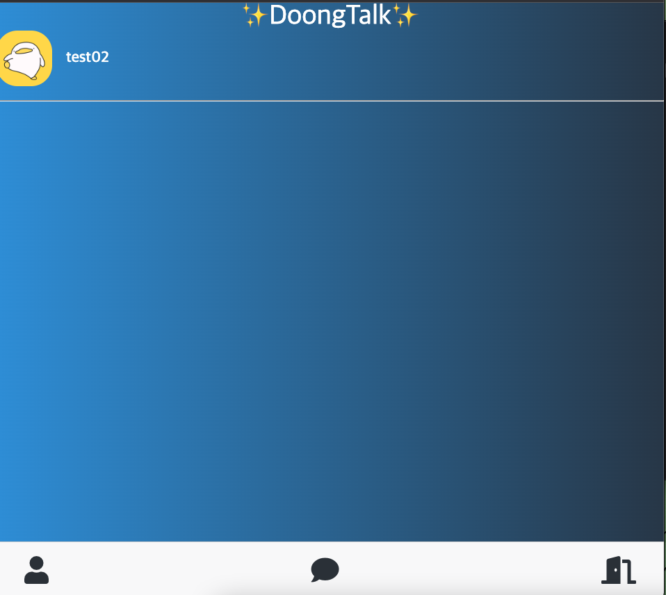
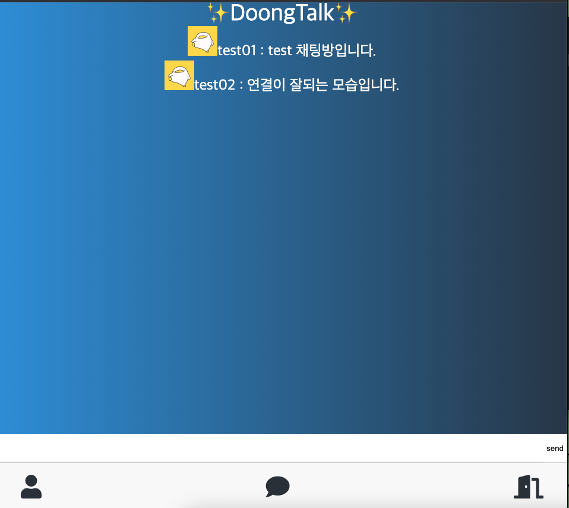
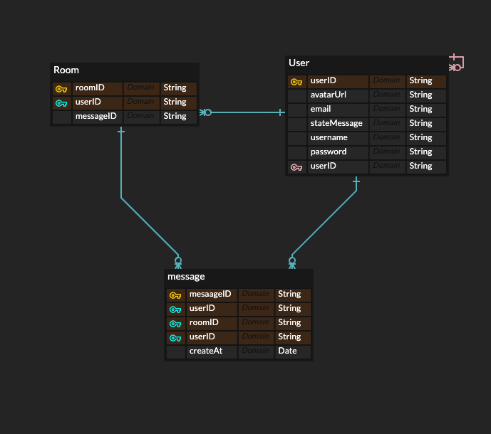

# DoongTalk
카카오톡 리뉴얼 기능입니다. 기존에 있는 카카오톡에 MongoDB, Nodejs, vaillaJS를 사용해서 기능을 추가해서 만들어 주었습니다. 

### 진행기간 
2022/03/27 ~ 2022/04/21

 

### 프로젝트 설명 
- 이전에 youtube 클론 코딩을 하였는데 나만의 사이드 프로젝트를 진행하고 싶은 생각에 Socket.io를 사용하여 채팅방을 구현을 하였습니다. 
- MongoDB, AWS S3, MonogoDB Atlas, Heroku App을 사용하여 배포하였습니다. 

# 사용한 기술 스택 
Front-End : PUG, SCSS  
Back-End : Node.js, express  
DevOps : AWS- S3, MongoDB, herokuApp  
Tools : VS Code  

# 채팅 어플 라우터 URL 구성 
### globalRouter
/login -> 로그인 
/join -> 회원가입 
/search -> 친구 찾기 
/logout -> 로그 아웃 
 

### chatRouter 
/chat/:user_id/:friend_id -> 채팅방
/chat/rooms -> 채팅방들 
 

### userRouter
/users/eidt -> 유저 정보 변경 
/users/change-password -> 유저 비밀번호 

### apiRouter 
/search/add -> 유저검색 

## 화면 구성 
### 로그인 화면

- username , password를 입력하여 로그인 할 수 있습니다. 

### 회원가입

- Email, Name을 입력하고 Username, password를 통해서 회원가입을 할 수 있습니다.
- 이미 있는 Email이나 Username이라면 아래 사진과 같은 화면이 표시됩니다.
- 로그인 화면으로 가기를 통해서 로그인 화면으로 갈 수 있습니다.

### 홈화면

- 친구의 상태 메시지와 나의 상태메시지를 볼 수 있으며 친구를 클릭하여 채팅방을 갈 수 있습니다.
- 돋보기 버튼을 통해서 친구 찾기를 들어갈 수 있습니다.
- = 을 클릭하며 유저의 정보를 변경할 수 있습니다.
- 사람 버튼을 누르면 홈화면으로 이동합니다.
- 채팅 버튼을 클릭하면 채팅방 화면으로 이동하게 되어집니다.
- 문을 여는 아이콘을 클릭하면 로그아웃이 되어집니다.

### 친구추가

- 정확한 친구의 이메일을 입력후, Search버튼을 누르면 아래와 같이 유저의 사진과 이름이 표시됩니다.
- +버튼을 클릭하면 친구가 추가되어 집니다.

### 유저 프로필 수정

- 유저의 상태 정보를 변경할 수 있습니다.
- 파일 선택을 클릭하여 유저 프로필의 사진을 변경할 수 있습니다
- Change Password를 클릭하면 비밀번호를 변경할 수 있습니다.

### 비밀번호 변경 

- 이전의 비밀번호와 새로운 비밀번호를 입력한 후 change password를 누르면 비밀번호가 변경됩니다. 

### 생성된 채팅방들 

- 채팅 버튼을 클릭 한 후의 모습입니다. 유저와 한 채팅방이 나타나게 됩니다.
- 채팅을 한 유저를 클릭하면 채팅방이 화면에 나타나게 됩니다.

### 채팅방

- 텍스트를 적은 후 Send 를 누르거나 Enter를 클릭하면 채팅을 칠 수 있습니다.

### 데이터베이스 구조도
